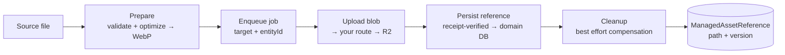
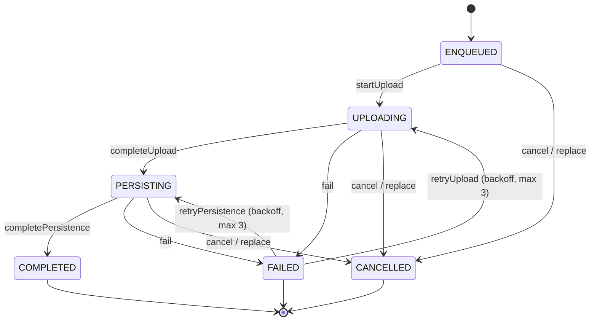
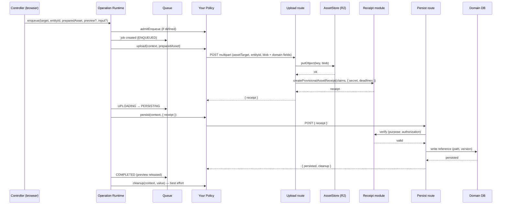
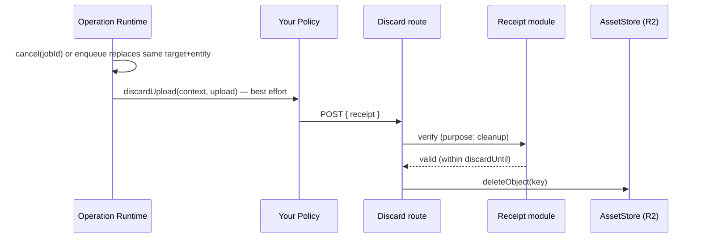

# Asset Manager

Domain-agnostic module that owns the full lifecycle of user-uploaded assets in the admin app: validation and optimization, queueing, upload to object storage (Cloudflare R2), authorization of persistence, and compensation on failure or cancellation.

- **Who it helps:** any feature that needs file/image uploads without re-implementing the pipeline.
- **What it gives you:** a prepared, validated asset (`PreparedAsset`), a queue with retries and progress, a storage transport, signed receipts, and a final `ManagedAssetReference { path, version }` you store in your domain.
- **Where it lives:** `apps/admin/src/shared/assets-manager/` — shared, domain-agnostic. It knows nothing about your feature; your feature teaches it what the asset means.

## Quick path

Integrate a new asset target in 6 steps (full detail in the integration guide below):

1. Add your target to `ASSET_TARGET` in `client/contracts.ts`.
2. Define your `ResizeSpec` (dimension policy).
3. Implement `AssetOperationPolicy` (`upload`, `persist`, `cleanup`; `discardUpload`/`admitEnqueue` when needed).
4. Bootstrap it once via `runtime.ensure(...)` at client module load.
5. Build three server routes: upload, persist, discard (helpers provided).
6. Build your controller/hook: prepare → enqueue → subscribe → retry/cancel.

Verify with `bun run type-check && bun run lint`.

---

## Architecture

```
┌─────────────────────────────── Consumer (your feature) ───────────────────────────────┐
│  React UI / hooks                 AssetOperationPolicy              Server routes      │
│  (prepare, enqueue, retry)        (upload/persist/cleanup)          (upload/persist/   │
│                                   (what the asset MEANS)             discard)          │
└───────────────┬──────────────────────────────┬───────────────────────────┬────────────┘
                │                              │                           │
┌───────────────▼──────────────────────────────▼───────────────────────────▼────────────┐
│                                   assets-manager                                     │
│  ┌─────────────────────────────── CLIENT (browser) ──────────────────────────────┐   │
│  │ preparation.ts + codec     asset-operation-runtime.ts       queue.ts          │   │
│  │ (validate → optimize)      (orchestrator: upload →         (job state machine │   │
│  │                            persist → cleanup)               + shared store)    │   │
│  └───────────────────────────────────────────────────────────────────────────────┘   │
│  ┌─────────────────────────────── SERVER (server-only) ──────────────────────────┐   │
│  │ multipart.ts                 provisional-asset-receipt.ts     asset-store.ts   │   │
│  │ (parse uploads)              (signed authorization)          + R2 adapter      │   │
│  └───────────────────────────────────────────────────────────────────────────────┘   │
└──────────────────────────────────────────────────────────────────────────────────────┘
                │                                                    │
       ┌────────▼────────┐                              ┌────────────▼───────────┐
       │  R2 bucket       │                              │  Your domain database │
       │  (blobs)         │                              │  (path + version)     │
       └─────────────────┘                              └────────────────────────┘
```

### Layer responsibilities

| Layer         | Files                                                            | Responsibility                                                                                                                     |
| ------------- | ---------------------------------------------------------------- | ---------------------------------------------------------------------------------------------------------------------------------- |
| Contracts     | `contracts.ts`, `managed-asset-reference.ts`, `format-config.ts` | Shared types: targets, prepared assets, references, output format (single source of truth: WebP).                                  |
| Preparation   | `preparation.ts`, `browser-image-codec.ts`                       | Validate MIME/size, decode, resize, encode WebP (quality ladder, size limits). Codec injectable for tests.                         |
| Queue         | `queue.ts`, `shared-asset-queue.ts`                              | Job state machine, one active job, retries with backoff, per-entity replacement, preview release. Singleton store for reactive UI. |
| Orchestration | `asset-operation-runtime.ts`, `asset-operation-*`                | Policy registry per target; runs `upload → persist → cleanup` with timeouts, abort, correlation, generation guards.                |
| Server        | `multipart.ts`, `asset-store.ts`, `r2-adapter.ts`                | Upload parsing, storage transport (`putObject`/`deleteObject`).                                                                    |
| Receipts      | `provisional-asset-receipt.ts`, `asset-receipt-config.ts`        | HMAC-signed authorization to persist/discard, with TTL deadlines.                                                                  |

## Core concepts

**Division of responsibility.** The module owns _how_ files move and get optimized; the consumer owns _what the asset means_: its dimension policy, its domain reference, its conflict rules, its persistence.

**Targets.** Every asset kind is identified by an `ASSET_TARGET` constant and has exactly one registered `AssetOperationPolicy`. Targets registered: `artist-avatar`, `edition-poster`.

**Policies.** The consumer contract per target: `admitEnqueue?`, `upload(context, preparedAsset) → TUpload`, `persist(context, upload) → { persisted, cleanup }`, `cleanup(context, value)`, `discardUpload?(context, upload)`. `register` throws on duplicates; `ensure` is idempotent.

**Receipts.** A provisional upload is authorized by a signed receipt (`createProvisionalAssetReceipt`) with deadlines: `persistUntil` and `discardUntil`. Consumers verify it with the matching purpose (`authorization` | `cleanup`) before touching domain state.

**References.** The durable outcome is `ManagedAssetReference { path: string | null, version: string | null }` — the only thing your domain stores.

---

## Flows

### Asset lifecycle



### Queue state machine



Rules the queue enforces: **one active job at a time** globally; **one job per target + entity** (enqueuing again cancels the previous non-terminal job); previews are released at terminal states.

### Upload → persist → cleanup (happy path)



### Cancel / replace (compensation)



---

## Public API (summary)

| Area        | API                                                                                                                                                                                | Purpose                                                               |
| ----------- | ---------------------------------------------------------------------------------------------------------------------------------------------------------------------------------- | --------------------------------------------------------------------- |
| Contracts   | `ASSET_TARGET`, `PreparedAsset`, `LocalPreviewHandle`, `ResizeSpec`                                                                                                                | Shared vocabulary between module and consumer.                        |
| Preparation | `createPreparationController(codec)`, `prepareAsset()`, `createBrowserImageCodec()`                                                                                                | Validate + optimize; cancellation included.                           |
| Runtime     | `getSharedAssetOperationRuntime()` → `ensure/register`, `canEnqueue`, `enqueue`, `cancel`, `remove`, `retryUpload`, `retryPersistence`, `retryCleanup`, `subscribeCleanupFailures` | Orchestrates jobs; single app-wide singleton.                         |
| Store       | `getSharedAssetQueueStore()` → `getState`, `subscribe(selector, listener)`                                                                                                         | Reactive mirror of the queue for UI (progress, failures, completion). |
| Server      | `parseAssetUpload(request)`, `AssetStore`, `R2Adapter` + `createR2Config()`                                                                                                        | Multipart parsing and object storage transport.                       |
| Receipts    | `createProvisionalAssetReceipt`, `verifyProvisionalAssetReceipt`, `getAssetReceiptSecret()`                                                                                        | Signed authorization with deadlines.                                  |

**Environment variables:** `R2_ACCOUNT_ID`, `R2_BUCKET_NAME`, `R2_ACCESS_KEY_ID`, `R2_SECRET_ACCESS_KEY`, `ASSET_RECEIPT_SECRET`.

---

## Integration guide (new target)

### 1. Client — target and policy

```ts
// contracts.ts: add your target
export const ASSET_TARGET = {
  /* ...existing... */ YOUR_TARGET: 'your-target'
} as const

// your feature: policy (abstract shape)
const policy: AssetOperationPolicy<Receipt, Reference, null> = {
  admitEnqueue({ target, entityId, snapshot }) {
    /* reject duplicates */
  },
  async upload({ context, preparedAsset }) {
    const form = new FormData()
    form.append('assetTarget', context.target)
    form.append('entityId', context.entityId)
    form.append('blob', preparedAsset.blob)
    // ...your domain fields...
    const res = await fetch('/api/your-assets', {
      method: 'POST',
      body: form,
      signal: context.signal
    })
    return { receipt: (await res.json()).receipt }
  },
  async persist({ context, upload }) {
    const res = await fetch('/api/your-assets/persist', {
      method: 'POST',
      headers: { 'content-type': 'application/json' },
      body: JSON.stringify({ receipt: upload.receipt }),
      signal: context.signal
    })
    return { persisted: await res.json(), cleanup: null }
  },
  async cleanup() {},
  async discardUpload({ context, upload }) {
    /* POST receipt to discard route */
  }
}
```

Bootstrap once at client module load (import side effect):

```ts
// your-feature/_lib/your-asset-composition.ts  ('use client')
import { getSharedAssetOperationRuntime } from '@/shared/assets-manager/client/asset-operation-runtime'
export function ensureYourAssetPolicy() {
  getSharedAssetOperationRuntime().ensure(ASSET_TARGET.YOUR_TARGET, policy)
}
ensureYourAssetPolicy()
```

### 2. Server — three routes

| Route                           | Uses                                                                       | Does                                                                 |
| ------------------------------- | -------------------------------------------------------------------------- | -------------------------------------------------------------------- |
| `POST /api/your-assets`         | `parseAssetUpload` → `store.putObject` → `createProvisionalAssetReceipt`   | Validates, stores the blob, returns `{ receipt }`.                   |
| `POST /api/your-assets/persist` | `verifyProvisionalAssetReceipt(purpose: 'authorization')`                  | Writes the reference into your domain; returns the persisted record. |
| `POST /api/your-assets/discard` | `verifyProvisionalAssetReceipt(purpose: 'cleanup')` → `store.deleteObject` | Removes the uploaded object after cancel/replace.                    |

Derive storage keys from your domain identity (slug/id + version). Keys are permanent — never reuse them across versions.

### 3. Client — controller/hook

```
selectFile → prepare → hold PreparedAsset + preview
submit    → canEnqueue → enqueue(target, entityId, preparedAsset, preview, input)
subscribe → store.subscribe: progress (sentBytes/totalBytes), failure (error, failedStep), completion
retry     → runtime.retryUpload / retryPersistence per failedStep (skip stable error codes)
cancel    → runtime.cancel / runtime.remove
```

For React, expose the controller through a hook backed by `useSyncExternalStore`.

### What the module does for you (no extra code)

- Automatic retries with backoff (max 3) per failed step, only while the queue is idle.
- Replacement semantics: a new enqueue for the same target+entity cancels and discards the previous upload.
- Operation timeouts (30s per step) and abort propagation via `context.signal`.
- Preview object URLs released automatically at terminal states.
- Deterministic error codes (e.g. conflicts, `INVALID_RECEIPT`) surface in `job.error` — treat them as non-retryable lifecycle outcomes and show them to the user.

### Constraints (by design)

| Limit          | Value                                              |
| -------------- | -------------------------------------------------- |
| Source formats | JPEG, PNG, WebP                                    |
| Source size    | ≤ 10 MB                                            |
| Output         | WebP, ≤ 1 MB                                       |
| Upload request | ≤ 1.25 MB (multipart)                              |
| Receipt TTL    | ~5 min (`persistUntil` / `discardUntil` deadlines) |

---

## Testing

Unit tests live in `apps/admin/tests/unit/shared/assets-manager/`, mirroring the source tree: queue, preparation, codec, runtime, store, receipts, multipart, R2 adapter, contracts. When adding a target, add tests for your policy, controller, and routes following those patterns.

## Reference consumer

A complete working integration exists in the artist catalog feature (`apps/admin/src/app/(core)/artistas/` — avatar upload). Use it as the reference implementation when wiring a new target.

## Related docs

- Agent skill: `.opencode/skills/asset-manager/` — consumer integration contract for AI agents (abstract, implementation-agnostic).
